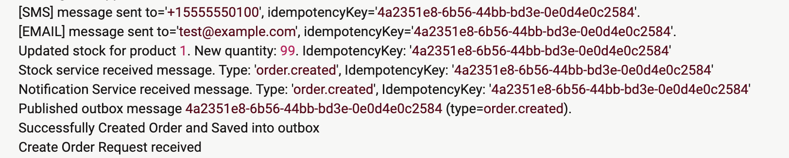

This project contains microservices built with **.NET 10**.


Highlights:
- Independent PostgreSQL databases (order, stock, notification)
- Async communication with RabbitMQ
- Outbox pattern for reliable event publishing
- Idempotency and retries around message publishing
- Centralized logging with Seq
- Containerized services using Docker and Docker Compose

Each service follows **Clean Architecture** (Presentation → Application → Domain → Infrastructure) and uses:

- Scalar
- Seq
- Repositories
- EF Core
- Database
- Validator (OrderService)

## Services

### OrderService
Responsible for creating orders and used background service for 
publishing an `order.created` event via the Outbox Pattern.

Local (dotnet run):
- Base URL: http://localhost:5050
- Endpoints:
  - GET /api/health
  - POST /api/orders

### NotificationService
Listens for `order.created` and sends notifications (Email/SMS) by extracting user data from the event.

Local (dotnet run):
- Base URL: http://localhost:5051
- Endpoints:
  - GET /api/health
  - GET /api/notifications

### StockService
Keeps product stock and consume event `order.created` to decrease stock.

Local (dotnet run):
- Base URL: http://localhost:5052
- Endpoints:
  - GET /api/health
  - GET /api/products
  - GET /api/products/{id}

## Messaging

- RabbitMQ exchange: orders
- Exchange type: fanout
- Event: order.created

### Running with Docker Compose
```
docker compose up --build
```

Notes:
- RabbitMQ management UI: http://localhost:15672 (username: guest, password: guest)
- Seq dashboard: http://localhost:5341 (username: admin, password: uowe!^a210.!)

## Seed data (StockService)

| ProductId | Name            | Stock |
|----------:|-----------------|------:|
| 1         | Classic T-Shirt | 100   |
| 2         | Jacket          | 150   |
| 3         | Sneakers        | 200   |

## Example requests to test
It is possible to send request via .http files, through Scalar in each service, or using the commands below.

### Create Order
```
curl http://localhost:5050/api/orders \
  --request POST \
  --header 'Content-Type: application/json' \
  --header 'Accept: */*' \
  --data '{
  "productId": 1,
  "quantity": 2,
  "user": {
    "name": "Test User",
    "email": "test@example.com",
    "phoneNumber": "+15555550100"
  }
}'
```

### Example request to see product stock
```
curl http://localhost:5052/api/products 
```

## Centralized Log Preview
